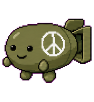

# Codex Pets

---

## Java

*A sleepy, plain, and simple cup of coffee.*


Install Java:

```sh
curl -fsSL https://raw.githubusercontent.com/CratesSo/Codex_Pets/main/install/java.sh | bash
```

---

## Elyndex

*A sleek Culture-inspired floating drone.*


Install Elyndex:

```sh
curl -fsSL https://raw.githubusercontent.com/CratesSo/Codex_Pets/main/install/elyndex.sh | bash
```

---

## Nukie

*A laid-back atomic bomb with a painted peace sign.*



Install Nukie:

```sh
curl -fsSL https://raw.githubusercontent.com/CratesSo/Codex_Pets/main/install/peacemaker.sh | bash
```

---

## Backup Behavior

*Existing pets with the same id are saved with a timestamp before the new copy is installed.*
